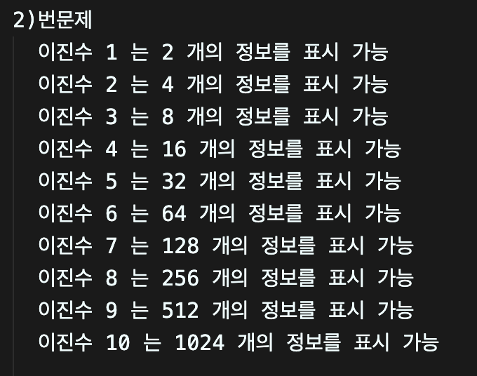
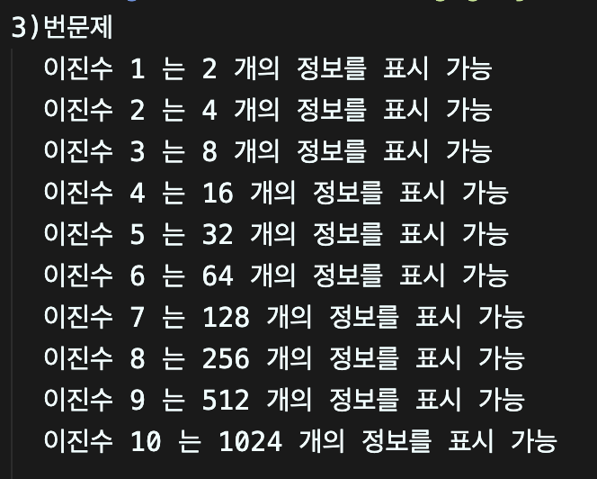

# 송길주 연습문제 과제 
> 2024-08-19

## 문제1
```
const 수학 = "b";

if(수학 === "a" || 수학 === "b" || 수학 === "c"){
  console.log("이 과목을 pass 했습니다");
} else {
    console.log("이 과목을 pass 하지 못했습니다"); }
```


---

## 문제2
```
let x = 0; //이진수
let y = 1; //2개표현

while (x < 10) { //10개의 이진수는 총 몇개의 정보표현?
  x++; // 이진수 하난씩 늘어날때
  y *= 2; // 2배씩 표현할수있다

  console.log(`이진수 ${x} 는 ${y} 개의 정보를 표시 가능`);
}
```


---
## 문제3
```
let x = 1; 

for(let y = 1; y<=10; y++){ //10개의 이진수가 하나씩 증가
  x *=2; //2배씩 표현
  console.log(`이진수 ${y} 는 ${x} 개의 정보를 표시 가능`);
}
```


